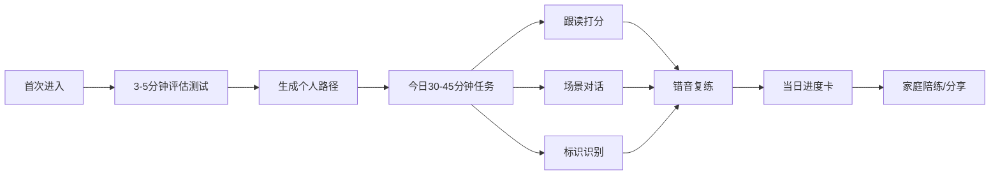
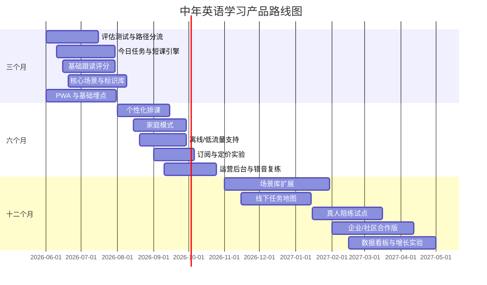

# 面向中年中文母语者的英语学习产品方案研究报告

## 目录

执行摘要与研究方法｜中年学习者的痛点与行为特征｜竞品调研与市场启示｜产品需求、学习内容与 Codex 实现要点｜UX、技术实现与数据合规｜商业模式与 MVP 路线图

## 执行摘要与研究方法

本报告面向“40–65岁、中文母语、以日常生活听说读为目标”的英语学习产品设计。公开资料中，**严格限定到“40–65岁中文母语者英语学习App用户”**的连续面板数据并不充足，因此本报告采用“交叉取证”方法：一方面使用中国官方适老化政策、互联网与中老年线上教育报告，确认该人群的数字可达性、时间约束和社交/分享行为；另一方面使用近五年成人/中老年外语学习研究，识别其动机、认知负担、情绪需求和教学适配点；再结合主流学习产品的官方功能页与应用商店用户反馈，提炼出一个**更适合中年学习者的、实用场景驱动、低压反馈、短时高频、强可视化、支持家庭共学**的网页/PWA 产品方案。整体结论是：如果把“考试思维”和“青年化游戏化叙事”降到次要位置，把“现实生活任务”“清晰反馈”“适老交互”“家人陪练”和“低门槛发音纠错”放到核心位置，这类产品比现有主流英语产品更有机会形成差异化。citeturn40view0turn7view1turn38view0turn7view2turn41search1

**关键结论**

- 中年学习者最强的学习动机不是考试，而是**旅行/探亲、代际沟通、现实生活沟通、自我提升与保持认知活跃**；因此产品应以“出门就能用”的生活任务为主线，而不是以语法体系或考试书单为主线。citeturn7view1turn38view0turn7view3
- 该人群并非不接受线上学习。面向45岁及以上样本的中国中老年教育报告显示，**线上学习方式已覆盖九成兴趣学习人群**，且**94%**认为网络课程相对传统面授更有优势，主因是“随时随地学习、节省时间和交通成本”。citeturn40view0turn39search2
- 产品设计的第一原则应从“内容多”转向“负担低”。研究对老年及成熟学习者反复指出，**工作记忆、处理速度、听力与发音控制**会增加学习成本，尤其在55岁以上更明显；因此课程粒度、音频语速、字幕、字体、点击目标、反馈维度都要做减负。citeturn7view2turn29view1turn6search19turn30search6turn31search0
- 现有竞品普遍存在三类断层：**要么强记忆弱开口，要么强交换弱结构，要么强功能弱适老**。这意味着“中年友好英语产品”不是简单复制 Duolingo、扇贝或 HelloTalk，而是重组它们的优点。citeturn13view4turn21view0turn18view0turn13view2turn25search9
- MVP 最值得优先做的，不是“大而全课程库”，而是五件事：**初测分流、今日 30–45 分钟任务、发音跟读反馈、场景模拟对话、标识识别训练**。这五项可以最直接验证留存、完课率和“学完即能用”的用户价值。citeturn28view2turn7view1turn40view0turn44search2turn44search10

**研究方法与优先来源**

| 来源层级 | 本报告优先度 | 主要用途 | 代表来源 |
|---|---:|---|---|
| 官方政策/官方报告 | 最高 | 适老化、数字鸿沟、数据合规、用户数字可达性 | 国务院办公厅/国家卫健委关于解决老年人运用智能技术困难的实施方案，工信部适老化改造进展，CAC《个人信息保护法》，W3C WCAG，Apple/Android 无障碍规范。citeturn41search1turn41search5turn41search0turn45view0turn30search6turn31search0turn30search1 |
| 原始论文与学术摘要 | 高 | 动机、认知负担、情绪需求、成人/中老年教学启示 | Wei 等 2024、Geng & Jin 2023、Sun 2022、Ma 2022、ERIC 成人微学习研究。citeturn7view1turn7view2turn8search3turn38view0turn28view2 |
| 主流产品官方页面/帮助中心 | 高 | 竞品功能、付费模式、产品定位、适用人群 | Duolingo、Babbel、Rosetta Stone、HelloTalk、Busuu、Memrise、EF、流利说、有道、扇贝等官方或应用商店页面。citeturn13view4turn21view0turn22view0turn18view0turn16search8turn17view0turn23view0turn24view0turn12search2turn13view2 |
| 用户评论/商店评价 | 中高 | 体验摩擦、付费阻力、广告/订阅/自由度问题 | Duolingo、Busuu、百词斩、有道等应用商店评论样本。citeturn37view3turn36view3turn13view0turn13view3 |

**证据边界与缺口**

本次公开检索**未找到可直接复用的公开大盘数据**，例如：40–65岁中文母语者英语学习 App 的 7 日/30 日留存行业基准、该年龄段对 AI 口语评测的接受度、英语场景化课程的客单价分布、以及“家庭共学”在英语学习领域的真实渗透率。建议在产品立项后补做三类一手研究：  
其一，**问卷**，样本量 200–500，覆盖一二线与三四五线、40–49/50–59/60–65 三个年龄段；  
其二，**半结构访谈**，15–20 位用户 + 5–8 位家属；  
其三，**4 周可用性日志研究**，追踪真实学习时长、弃学节点、最常错音和最常失败场景。  

## 中年学习者的痛点与行为特征

从互联网使用看，40–49岁、50–59岁与60岁及以上网民分别占中国网民的 **15.2%**、**14.1%** 和 **14.0%**；而面向45岁及以上的中老年教育蓝皮书则显示，该群体已经广泛接受线上兴趣学习，说明“线上不可达”不是核心问题，真正的问题是**产品是否足够简单、实用、持续可坚持**。citeturn1view0turn40view0

| 主要痛点或行为特征 | 证据/典型数据 | 对产品的直接含义 |
|---|---|---|
| 学习目标高度实用，优先“能沟通、能出行、能探亲” | 中国 older adults 英语学习调查（n=510）显示，核心动机包括**出国旅行或探亲、保持大脑活跃、支持代际沟通与兴趣**。citeturn7view1turn8search10 | 课程主线应是“场景任务”，不是“语法章节”。 |
| 沟通、自我提升、社会责任是主要驱动 | 针对中国中老年英语学习者的研究指出，主要动机是**沟通需求、社会责任与自我提升**。citeturn38view0 | 产品首页需要先问目标，再生成路线。 |
| 时间碎片化，线上学习被接受是因为灵活 | 蓝皮书显示，**线上学习覆盖九成**兴趣学习人群；**94%**认为网课更有优势，其中 **71%**提到“随时随地学习、节省时间和交通成本”。citeturn40view0turn39search2 | 必须以 5–15 分钟短课为基础单位，并支持中断续学。 |
| 强社交属性，愿意分享给亲友 | 蓝皮书显示，**59%** 的视频号中老年兴趣学习人群看到好内容会分享给亲友；线上学习后 **83%** 会继续参加相关线下活动。citeturn40view0 | 家庭陪练、打卡分享、线下任务卡要优先进入产品。 |
| 数字鸿沟并未消失，复杂流程会直接劝退 | 国务院实施方案明确指出，不少老年人**不会上网、不会使用智能手机**，在出行、就医、消费等高频事项中遇到困难；工信部为此持续推进适老化改造，2024 年已完成 **2577个**常用网站/APP 改造，2025 年报道为 **3000余家**。citeturn41search1turn41search5turn41search0 | 交互层级必须浅，流程必须单线，且要有“大字/语音/人工帮助”入口。 |
| 词汇记忆更吃力，尤其在无上下文时 | 访谈研究中，学习者直接提到“**不容易记住单词**”；同时 older adults 研究反复指出，后天外语学习会受到工作记忆下降影响。citeturn7view3turn29view1turn7view2 | 词汇不能裸背，必须嵌入句子、标识和场景。 |
| 处理速度与工作记忆负担更敏感 | 教学研究总结 older adults 的外语学习挑战包括**declining working memory**；技术辅助 L2 词汇学习元分析也表明，移动学习、短频复现更有效。citeturn7view2turn29view1turn28view1 | 课程每次只学少量新项，并加强复现与复习排程。 |
| 听力负担上升，尤其对快语速和噪声更敏感 | older adults 外语学习研究提到**hearing impairment** 是挑战之一；WHO 和医学资料也指出听力损失随年龄上升而更常见。citeturn7view2turn29view1turn6search19turn6search13 | 全部音频都应配语速控制、逐句回放和字幕。 |
| 发音控制与开口焦虑并存 | 研究指出 older adults 可能面临**phonatory muscles control loss**；相关个案研究也强调教师需降低**language anxiety**、提升外语学习乐趣。citeturn7view2turn29view1turn7view3 | 需要“低压开口”环境，优先 AI 跟读和 AI 对话，而非强迫真人开口。 |
| 学习体验质量比考试结果更重要 | 研究显示，later-life L2 学习中，**学习体验质量的重要性高于结果本身**；学习者需要乐趣、正向互动和“适度有挑战”的任务。citeturn7view2 | 产品不宜用挫败型闯关，要多用“稳步完成 + 明确进步反馈”。 |
| 喜欢可见成就，但不喜欢高失败成本 | Duolingo 用户评论称其“fun and enjoyable”，但也提到广告打断；Busuu 用户一方面认可社群反馈与进步感，另一方面抱怨免费模式中复习受限。citeturn37view3turn36view3 | 激励可以有，但不能以广告、体力值或过强惩罚伤害中年用户体验。 |
| 线上课程发现路径越来越内容化、短视频化 | 蓝皮书指出，中老年兴趣学习人群了解网课时，**短视频/直播渠道占比 66%**，并优先在微信生态内转化。citeturn39search2turn40view0 | 获客与内容设计都要支持“短内容试学—一键进入正式课”的路径。 |

综合来看，这个群体**不是学不会**，而是对“学习成本—现实收益”的比值极为敏感：如果十分钟就能学会一个真实可用的餐厅点单框架，他们会继续；如果一上来就是抽象音标、长词表、复杂 UI、快语速、广告打断和社交压力，他们会迅速流失。citeturn40view0turn7view2turn7view3turn28view2

## 竞品调研与市场启示

| 产品 | 目标用户 | 核心功能 | 付费模式 | 优点 | 局限 | 适合中年人程度 |
|---|---|---|---|---|---|---:|
| Duolingo | 大众初学者、碎片化学习者 | 40+ 语言、bite-sized lessons、听说读写、Practice Hub；Max 提供 Roleplay 与 Video Call。citeturn13view4turn20search2turn20search1turn20search3 | 免费 + Super/Max 订阅。citeturn37view3turn20search11 | 上手快、节奏短、激励强。 | 风格偏年轻化；广告/订阅打断在评论中是摩擦点；对中年用户的“生活任务”不够聚焦。citeturn37view3 | 3 |
| Babbel | 希望系统学会“实用对话”的成人 | 短课、真实对话、原生语言定制、spaced repetition、语音识别、placement test、证书。citeturn21view0turn21view1turn21view3 | 订阅制，价格随地区与时长变化。citeturn21view2 | 成人导向明显，解释清楚，节奏友好。 | 偏“成熟成人学习者”逻辑，但对中国中年用户的本地化生活场景和适老 UX 仍不足。 | 4 |
| Rosetta Stone | 偏沉浸式学习者、重发音者 | Dynamic Immersion、TruAccent、Stories、Phrasebook、10 分钟课。citeturn22view0turn22view2 | 订阅 + Lifetime 选项。citeturn22view2 | 发音反馈强，旅行短语有帮助。 | 解释型脚手架相对弱；版本间离线能力差异需注意。citeturn22view0turn22view1turn22view2 | 3 |
| Busuu | 想要“课程 + 社群反馈”结合的成人 | 专家短课、发音/会话练习、进度追踪、社区反馈、官方证书、AI Conversation。citeturn16search8turn16search0turn10search0 | Freemium + Premium。citeturn36view3 | 结构化较好，社区反馈真实。 | 陌生人社群对部分中年人有门槛；免费模式复习受限。citeturn36view3 | 4 |
| HelloTalk | 想和真人练口语的人 | 文字/语音/视频、翻译、纠错、Voiceroom、直播、教师、AI 匹配。citeturn18view0turn18view1 | 免费 + VIP 会员。citeturn18view2 | 真实互动强，能练真实口语。 | 结构化课程弱；社交压力、陌生人沟通与安全感是天然门槛。 | 3 |
| Memrise | 想学“真实日常表达”的用户 | 大量母语者视频、实用短语、短测验、沉浸式学习、phrasebook。citeturn17view0 | 免费 + 订阅。citeturn17view0 | 听感真实，旅行和日常表达友好。 | 体系化语法较弱，不足以独立承载完整路径。 | 4 |
| EF English Live | 有较强目标感的成人、职场/出国用户 | 24/7 课程、1对1/小班、真实场景、Hyperclass、A1-C2 证书、成人课程。citeturn23view0turn23view1turn23view2 | 订阅/课程计划。citeturn23view2 | 成人定位清晰，场景和师资都强。 | 成本更高，时间投入更重，不够“轻量日更”。 | 4 |
| 英语流利说 | 中国本地成人与口语提升用户 | 自适应诊断、AI 老师、配音、场景对话、真人语伴、实时打分。citeturn24view0turn25search2turn25search9 | 免费 + 课程包/会员。citeturn25search1turn25search9 | 本地化强，口语评分与场景素材适合中文用户。 | 产品线较多，信息架构容易变重；内容广于“中年生活英语”这一单一目标。 | 4.5 |
| 网易有道词典 | 翻译/查词刚需用户与轻学习者 | 109 语种翻译、拍照/对话/离线翻译、单词本、地道发音、作文批改。citeturn12search2turn12search3 | 免费 + VIP。citeturn12search2 | 旅行与即时求助非常实用，离线能力重要。 | 不是完整课程产品，更像工具箱。 | 3.5 |
| 扇贝单词英语版 | 考试型和词汇型用户 | 词汇量测试、AI 规划、动态复习、词文串学、听写/拼写/复述、战队。citeturn13view2turn11search0 | 免费 + 会员。citeturn13view2turn11search0 | 复习体系强、耐用。 | 官方定位明显偏**考试与词汇实战**，对中年人“生活英语”并非最佳主路径。citeturn13view2 | 2.5 |

这组竞品说明了三个市场事实。第一，**短课 + 复习算法 + 发音反馈**已经是行业共识；第二，**真实对话**正从“真人交换”走向“AI 场景会话”；第三，真正面向中年中文用户的缺口，不在“有没有课”，而在“是否足够实用、足够简单、足够少挫败、足够家庭友好”。Duolingo 与 Busuu 证明短课和激励有效，EF 与流利说证明“场景 + 口语”有价值，HelloTalk 证明真人互动真实但门槛高，扇贝/有道则证明工具和课程需要拆层组合。citeturn13view4turn36view3turn23view0turn25search9turn18view1turn13view2turn12search2

从产品机会看，最值得做的不是再做一个“泛英语平台”，而是做一个**“中年生活英语操作系统”**：左手是课程，右手是工具；左手帮用户学，右手帮用户当场用。也就是说，学习产品要天然内置“翻译求助、标识识别、慢速回放、救场表达、家庭代办沟通”能力。citeturn7view1turn40view0turn12search2

## 产品需求、学习内容与 agent 实现要点

建议的产品定位是：**为 40–65 岁中文母语者提供“每天 30–45 分钟、半年内打通生活英语基础”的中年友好网页/PWA 产品**。核心学习路径不是“班级—章节—考试”，而是“目标—评估—今日任务—现实使用—家人共学—进度反馈”。这一路径更符合中年学习者对实用性、灵活性和即时回报的要求。citeturn40view0turn7view1turn28view2



上面的流程图对应一个关键设计判断：中年用户不适合把大量时间耗在“找入口、做选择、猜规则”上，因此产品应在首页直接呈现“今天学什么、学完能做什么、哪里还没过关”。这一点与成人微学习研究、“线上学习因节省时间成本而更受欢迎”的中国中老年教育发现是一致的。citeturn28view2turn40view0

| 优先级 | 功能 | 设计理由 | 交互要点 | 示例界面元素 | 建议 KPI |
|---|---|---|---|---|---|
| 必须 | 评估测试 | 中年学习者目标差异大，动机以沟通/旅行/探亲为主，必须先分流。citeturn7view1turn38view0 | 3–5 分钟完成；测词汇、标识识别、听力、口语、发音五维；允许“跳题”。 | 雷达图、能力条、目标问卷、推荐路径卡 | 首测完成率 ≥85%；路径点击率 ≥70% |
| 必须 | 目标导向建档 | “学英语为了什么”直接决定内容优先级。citeturn7view1turn38view0 | 首次只问 4 项：目标、每天时间、是否有家人共学、是否即将出国。 | 目标标签：探亲/旅行/看病/租房/购物 | 目标设置完成率 ≥90% |
| 必须 | 短时高频课程 | 45+ 用户接受线上学习的重要原因就是灵活、省时。citeturn40view0turn39search2 | 1 课 5–12 分钟；3 课组成“今日任务”；可断点续学。 | “今日 3 小课”卡片、剩余时长标签 | 日均完成课数 2.2+；课程完课率 ≥75% |
| 必须 | 发音跟读与反馈 | 发音与开口焦虑是高频障碍，且 older adults 对细粒度错误定位有需求。citeturn7view2turn7view3turn44search2turn44search10 | 提供“整体分 + 维度分 + 错音定位 + 示例口型/舌位提示”；只纠 1–2 个关键错误。 | 得分环、错误音高亮、最小对立对、重录按钮 | 跟读提交率 ≥80%；二次重录率 40–60%；发音分 4 周提升 ≥10 分 |
| 必须 | 场景模拟对话 | 中年用户最需要的是现实生活的说话框架，而非抽象语法。citeturn7view1turn23view0turn20search1 | 采用“脚手架对话”：先选意图，再选句块，再逐步过渡到自由说。 | 场景胶囊：餐厅/机场/药房/问路；救场按钮“请慢一点” | 对话完成率 ≥65%；救场按钮使用率逐周下降 |
| 必须 | 标识识别训练 | 旅行/探亲是强动机，现实中先见到的往往不是句子而是标识。citeturn7view1turn12search2 | 图片识别 + 关键词解释 + 一键加入词库；先做机场/商店/医院高频标识。 | 标识图卡、关键字、中文解释、情境例句 | 标识题正确率 ≥70%；标识库复习完成率 ≥60% |
| 必须 | 微学习计划 | 成人微学习能提升效率与可接受度。citeturn28view2 | 自动生成 7 天计划；当天错过则自动重排，不显示“落后惩罚”。 | “今天 36 分钟”条、“已完成 2/3” | 周计划达成率 ≥55%；7 日留存 ≥35% |
| 必须 | 可视化进度 | 中年学习者更需要“我在变好”的确定感。citeturn7view2turn21view0 | 展示五维能力、近 7 天连续学习、最会/最不会场景。 | 能力雷达图、连续天数、里程碑徽章 | 周活跃用户中查看进度页比例 ≥50% |
| 必须 | 离线/低流量支持 | 适老与高可达性意味着不能默认高带宽稳定在线。官方产品也普遍提供离线或下载能力。citeturn22view2turn21view0turn12search2 | 支持下载今天任务；弱网自动切换低码率音频；离线后自动同步。 | 下载按钮、弱网提示、同步状态 | 离线任务完成率；离线同步成功率 ≥95% |
| 应有 | 家庭/陪练模式 | 中年用户有强分享属性，也存在代际沟通动机。citeturn7view1turn40view0 | 子女可查看“本周建议陪练句”；支持一键发送微信/短信练习卡。 | “陪爸妈练”卡片、家庭周报、双人跟读 | 家庭绑定率 ≥20%；家庭用户 30 日留存高于非家庭用户 |
| 应有 | 慢速听力与字幕控制 | 听力负担和语速压力需要显式控制。citeturn7view2turn6search19turn23view0 | 0.75x/0.9x/1.0x/1.1x；中英字幕分层；逐句循环。 | 语速滑杆、中英字幕开关、逐句循环 | 听力完播率 ≥65%；语速调节使用率 ≥30% |
| 应有 | 心理激励机制 | later-life L2 需要乐趣、正向互动和温和挑战。citeturn7view2turn20search16 | 以“今日完成”“场景解锁”“家庭连击”替代过强排名压力。 | 家庭 streak、鼓励语、解锁地图 | 鼓励弹层关闭率低；7 日留存提升 |
| 可选 | 真人陪练/社区 | 真实互动有价值，但应放在完成结构化练习之后。citeturn18view1turn18view0 | 先 AI 后真人；可选而非强制；默认预约制。 | 语伴预约、回放、纠错摘要 | 陪练购买率、场次完成率 |
| 可选 | 场景任务地图 | 线上 + 线下结合符合中老年学习行为。citeturn40view0 | “去超市找 3 个英文标识并拍照识别”；完成后奖励。 | 城市场景卡、任务清单、上传入口 | 线下任务参与率 ≥15% |

**学习内容设计建议**

内容库建议按“**词汇—句块—脚本—工具**”四层组织，而不是按传统教材单元组织。第一层是高频词；第二层是可直接调用的句块；第三层是整段场景脚本；第四层是救场工具，例如“请说慢一点”“我没听懂”“可以写下来吗”。这样可以降低中年人从“知道单词”到“开口使用”的转换损耗。citeturn7view1turn7view3turn21view0

| 内容类型 | 设计原则 | 样例 |
|---|---|---|
| 核心词汇库 | 只收“生活高频、可迁移”的词；先名词/动词/位置词，再补形容词。 | pharmacy, receipt, restroom, gate, refund, appointment, left, straight, bill |
| 句块库 | 句子不要太长，优先“功能句”。 | “I need help.” “Where is gate A12?” “Can you say it slowly?” “I’d like this one.” |
| 救场表达库 | 每个场景都要有 2–3 句保命表达。 | “Please write it down.” “I only speak a little English.” |
| 标识库 | 先机场/商超/医院/交通，再扩展酒店、学校、社区。 | Boarding, Check-in, Emergency Exit, Prescription, No Smoking |
| 对话脚本库 | 1 脚本 1 任务；每段最多 6 轮。 | 餐厅点餐、药房买药、向房东报修、电话预约、问路、机场安检 |
| 工具层 | 允许即时求助，不把用户逼回课程页。 | 整句翻译、关键词翻译、图片识别、语速调节、句子收藏 |

**音标教学策略建议**

“够用化 20 音优先”适合作为产品策略，但要明确这是一种**教学工程化简化方案**，不是对完整 IPA 的取代。考虑到中年学习者时间有限、发音焦虑明显，建议先训练最影响可懂度的 20 个高频音类/对比，再视需要进入完整音标。其目标不是“会背音标表”，而是“能分辨、能模仿、能在高频词里读准”。这一建议是基于 older adult 发音与认知负担研究所做的产品化推断，后续应通过 A/B 测试验证。citeturn7view2turn29view1turn44search2turn44search10

| 优先音类 | 代表对比 | 样例词 | 训练方式 |
|---|---|---|---|
| /iː/ vs /ɪ/ | 长短元音 | sheep / ship | 听辨 + 跟读 + 图片配对 |
| /e/ vs /æ/ | 前元音 | bed / bad | 最小对立对 + 句中训练 |
| /ʌ/ vs /ə/ | 非重读与中心元音 | bus / about | 重音位置提示 |
| /uː/ vs /ʊ/ | 长短后元音 | food / good | 慢速口型示范 |
| /θ/ vs /s/ | 舌尖音误替 | think / sink | 舌位动画 + 关键词重复 |
| /ð/ vs /z/ | 浊擦音误替 | this / zis | 跟读 + 纠错说明 |
| /r/ vs /l/ | 中文母语常见难点 | right / light | 录音对比 + 错误定位 |
| /v/ vs /w/ | 唇齿/双唇 | very / west | 唇形图示 |
| /b/ vs /p/ | 清浊/送气 | bill / pill | 爆破感知训练 |
| /tʃ/ vs /dʒ/ | 破擦音 | cheap / jeep | 词—短句—对话三级训练 |

**跟读练习设计**

跟读不应只给一个总分。更适合中年的做法是：先给整体分，再给**准确度、完整度、流利度、重音/停顿**四维反馈，最后只高亮 1–2 个最关键错误，否则会造成反馈过载。主流中国语音评测服务已经可以返回音素/单词粒度的评分结果，适合直接做前端可视化。citeturn44search0turn44search2turn44search10

| 练习阶段 | 时长 | 目标 | 样例 |
|---|---:|---|---|
| 听整句 | 10–15 秒 | 先建立整体语感 | “I’d like to buy this medicine.” |
| 分块跟读 | 20–30 秒 | 切短降低负担 | I’d like to / buy this / medicine |
| 重点纠音 | 20 秒 | 只练 1–2 个错误位 | /d/ + /ð/ 或 medicine 重音 |
| 整句重录 | 10–15 秒 | 把局部纠正迁移回整句 | 再录整句 |
| 复盘收藏 | 5 秒 | 留作明日复习 | 加入“我的难句” |

**慢速听力素材来源建议**

公开资源可优先引用或二次整理来自权威机构的免费英语学习资源，例如 British Council 和 Cambridge English 的分级听力/阅读活动；但在 MVP 阶段，更建议以**自制“中年生活英语慢速素材”**为主，因为现成公共资源很少完全贴合“看病、问路、退货、与学校/房东沟通”等中文用户高频场景。citeturn8search2turn8search7turn23view0

| 素材类型 | 为什么适合 | 样例栏目/做法 |
|---|---|---|
| 自制慢速对话 | 最能贴合中年生活场景 | 药房买药、超市退货、预约牙医 |
| 权威分级资源 | 质量稳定、可作补充 | 按 A1–B1 分层导入 British Council/Cambridge 免费资源 |
| 原声简化版 | 便于过渡到真实语速 | 真实对话 + 慢速重录 + 关键词字幕 |
| 标识播报素材 | 与标识识别联动 | “Gate changed to…” “Prescription pickup” |

**场景脚本模板建议**

| 场景 | 任务目标 | 固定句块 | 可变槽位 |
|---|---|---|---|
| 机场值机 | 找到柜台、托运行李 | “Where is check-in for ___?” | 航班号、柜台号、目的地 |
| 餐厅点餐 | 点单、忌口、结账 | “I’d like ___.” “No spicy, please.” | 菜名、数量、口味 |
| 药房/医院 | 描述症状、买药、预约 | “I have ___.” “How often should I take it?” | 症状、频率、日期 |
| 超市购物 | 询价、找货、退换 | “Where can I find ___?” “Can I return this?” | 商品、尺寸、颜色 |
| 租房/酒店 | 入住、报修、续住 | “The heater doesn’t work.” | 房间号、设施名 |
| 学校/社区 | 留言、问路、登记 | “I’m here to pick up my son.” | 姓名、地点、时间 |

**个性化路径规则建议**

| 初测结果 | 路径规则 | 课程占比建议 |
|---|---|---|
| 发音 < 60 | 每天必带 1 个跟读模块 + 3 个错音复练词 | 发音 35% / 场景 30% / 听力 20% / 词汇 15% |
| 听力 < 60 | 默认慢速 + 双语字幕 + 逐句循环 | 听力 35% / 场景 25% / 发音 20% / 词汇 20% |
| 标识识别 < 60 | 每天加入 1 组标识包 + 图片题 | 标识 25% / 场景 30% / 词汇 25% / 发音 20% |
| 口语 < 60 | 场景对话从“选句块”开始，延后自由说 | 对话 40% / 发音 25% / 听力 20% / 词汇 15% |
| 五维都 > 70 | 进入“实战强化”路线 | 场景 40% / 听力 25% / 口语 20% / 词汇 15% |

**每周学习量与时长建议**

这是一个产品侧建议值，而不是公开行业标准。考虑到成人微学习研究、主流短课产品时长设计，以及中年用户对时间灵活性的强诉求，建议把一周学习量控制在 **180–240 分钟**，即**每天 30–45 分钟、每周 5–6 天**。citeturn28view2turn21view0turn13view4

| 周维度 | 建议量 |
|---|---:|
| 新词 | 40–60 个 |
| 核心句块 | 15–20 个 |
| 场景脚本 | 4–6 个 |
| 跟读提交 | 40–70 次 |
| 标识识别题 | 20–30 题 |
| 总时长 | 180–240 分钟 |

**可直接交付给 Codex 的实现要点清单**

下表不是“唯一技术答案”，而是为了让开发者能够直接开工的**可实现颗粒度**。语音评测、语音识别与语音合成建议优先选择**在中国易接入、文档成熟、计费清晰**的服务；若必须做离线版，可在 PWA/未来 App 端引入本地 ASR/TTS 方案。国内可选语音能力包括腾讯云 ASR、阿里云智能语音交互、华为云 SIS、讯飞开放平台语音评测/合成、有道智云实时语音评测；离线开源可考虑 Vosk 或 sherpa-onnx。citeturn42search0turn42search1turn42search3turn42search6turn44search8turn44search10turn43search0turn43search1turn43search4

| 模块 | 推荐实现 | 说明 |
|---|---|---|
| 前端 | Next.js + TypeScript + PWA + IndexedDB | 先做网页，后续可用 Capacitor 或 React Native 复用业务逻辑 |
| 状态管理 | React Query + Zustand | 学习计划、评测结果、离线任务拆分管理 |
| 后端 | NestJS 或 FastAPI | NestJS 处理用户/课程/API；Python 服务处理评分编排与推荐 |
| 数据库 | PostgreSQL + Redis | PG 存用户、课程、记录；Redis 做会话、缓存、任务队列 |
| 对象存储 | COS / OSS / OBS 任一 | 存音频、图片、导出报告 |
| 语音识别 ASR | 腾讯云 / 阿里云 / 华为云 | 实时字幕、语音输入、对话转写。citeturn42search4turn42search1turn42search3 |
| 发音评测 | 讯飞 / 阿里云 / 有道 / 腾讯云口语评测 | 适合朗读打分、音标定位、流利度/完整度分析。citeturn44search0turn44search2turn44search10turn44search1 |
| 语音合成 TTS | 讯飞 / 阿里云 / 华为云 | 用于慢速示范音、句块播报。citeturn42search6turn42search9turn42search3 |
| 离线方案 | Vosk / sherpa-onnx | 适合未来 App 或本地弱网版。citeturn43search0turn43search1turn43search4 |
| 内容管理 | Headless CMS + 课程 Excel 导入 | 便于运营团队快速上新标识库、脚本库 |

**建议 API 设计**

```http
POST   /api/v1/onboarding
POST   /api/v1/assessment/start
POST   /api/v1/assessment/submit
GET    /api/v1/path/today
POST   /api/v1/pronunciation/evaluate
POST   /api/v1/dialogue/turn
POST   /api/v1/signage/recognize
POST   /api/v1/family/invite
GET    /api/v1/progress/summary
POST   /api/v1/offline/sync
```

**建议数据格式**

```json
{
  "user_id": "u_1024",
  "age_band": "50-59",
  "goal_tags": ["travel", "family_visit"],
  "daily_minutes": 40,
  "assessment": {
    "vocab": 58,
    "signage": 41,
    "listening": 52,
    "speaking": 36,
    "pronunciation": 34
  },
  "path_version": "p_2026_06_a"
}
```

```json
{
  "lesson_id": "scene_restaurant_001",
  "type": "dialogue",
  "level": "A1",
  "duration_sec": 420,
  "skills": ["speaking", "listening"],
  "target_chunks": [
    "I'd like this one.",
    "No spicy, please.",
    "Can I have the bill?"
  ],
  "rescue_lines": [
    "Please say it slowly.",
    "Can you write it down?"
  ]
}
```

```json
{
  "attempt_id": "att_7788",
  "audio_url": "cos://bucket/att_7788.wav",
  "score_breakdown": {
    "accuracy": 72,
    "fluency": 61,
    "completeness": 80,
    "stress_pause": 55
  },
  "error_spans": [
    {"token": "bill", "issue": "vowel", "hint": "/ɪ/ not /iː/"},
    {"token": "please", "issue": "final_sound", "hint": "hold /z/"}
  ]
}
```

**前端组件建议**

| 组件名 | 主要 Props | 用途 |
|---|---|---|
| `TodayPlanCard` | `minutes`, `lessons`, `resumeAt` | 首页今日任务 |
| `SkillRadar` | `scores` | 五维能力展示 |
| `ReadAloudPanel` | `referenceText`, `audioSrc`, `scoreBreakdown` | 跟读与反馈 |
| `DialogueBuilder` | `scene`, `chunks`, `rescueLines` | 场景对话 |
| `SignageCard` | `image`, `keyword`, `translation`, `example` | 标识识别训练 |
| `FamilyPracticeCard` | `sentence`, `shareText`, `qrCode` | 家庭共学 |
| `LargeTextToggle` | `scale` | 适老化字体开关 |
| `PlaybackSpeedSlider` | `rate` | 听力语速控制 |

## UX、技术实现与数据合规

中年友好设计不是“把字体放大”这么简单，而是要同时解决**视觉负担、理解负担、操作负担和情绪负担**。政府的适老化政策和互联网适老化推进，本质上都在指向同一件事：产品不能默认用户熟悉复杂数字流程，也不能把“不会用”解释成“用户问题”。citeturn41search1turn41search5turn41search0

| 设计点 | 建议值/做法 | 依据 |
|---|---|---|
| 默认字号 | 正文 18–20px；标题 24–28px；支持一键“大字模式” | Apple Dynamic Type 强调应支持系统级文本缩放；Android 14 支持最高 200% 缩放。citeturn30search1turn31search2turn31search19 |
| 对比度 | 正文至少 4.5:1；大号文字至少 3:1 | WCAG 最低对比度要求。citeturn30search6 |
| 行距与字距 | 行距至少 1.5；段间距至少 2 倍字号 | WAI 文本间距建议。citeturn30search3 |
| 点击区域 | 触控目标至少 48dp，关键按钮更大 | Android 官方可访问性建议。citeturn31search0 |
| 导航复杂度 | 底部一级导航控制在 4–5 个；每屏只保留 1 个主 CTA | 适老化场景下应减少决策点，这是对政策与研究结论的产品化回应。citeturn41search1turn40view0 |
| 语速控制 | 0.75x / 0.9x / 1.0x / 1.1x；逐句回放 | 听力负担与年龄相关挑战要求语速可控。citeturn7view2turn6search19 |
| 字幕分层 | 中文辅助字幕、英文对照字幕、隐藏字幕三挡 | 兼顾理解与过渡到独立听力。 |
| 语音输入 | 一键录音、自动重试、手动文本备选输入 | 避免单一输入失败即课程中断。 |
| 帮助入口 | 首页固定“不会用？点这里”；支持家属代管入口 | 适老化重点不是教程，而是即时援助。citeturn41search5turn41search8 |
| 情绪设计 | 不用“失败”“你落后了”措辞；多用“再试一遍就更准了” | later-life 学习更依赖正向体验。citeturn7view2 |

**语音与多媒体实现建议**

如果以网页/PWA 起步，浏览器端建议通过 `MediaRecorder` 采集 `audio/webm;codecs=opus`，服务端统一转码为 `wav / pcm_s16le / 16kHz / mono` 再送入评测或识别服务。这样能兼顾移动端兼容性与后端统一处理。对于口语评测，建议先只做**朗读型评分**，即单词、句子、短段落；开放问答型评分应在 6–12 个月后再上，因为它对提示词、ASR 误差、评分解释和合规都更复杂。支持英文单词/句子/段落/音标打分，并可输出准确度、流利度、完整度与音标维度结果的国内方案已经成熟，因此 MVP 并不需要自研声学评分模型。citeturn44search2turn44search8turn44search10

**埋点与数据分析建议**

建议最少埋以下事件：`assessment_started`、`assessment_completed`、`lesson_started`、`lesson_completed`、`pronunciation_retry`、`dialogue_rescue_used`、`signage_scan_finished`、`family_invite_sent`、`offline_sync_success`、`subscription_paywall_viewed`。每个事件至少带上 `age_band`、`goal_tags`、`lesson_type`、`minutes_spent`、`network_state` 五个维度，以便分别回答“谁在学、为什么学、在哪掉、掉在什么场景、弱网是否造成流失”。这是面向产品决策的数据最小闭环。  

**数据与隐私合规要点**

对于这类产品，**录音、评测结果、对话记录、拍照识别图片、学习画像**都属于需要重点管理的数据。中国《个人信息保护法》明确要求：处理个人信息须遵循合法、正当、必要、诚信原则，且收集范围应限于实现目的的最小范围；对敏感个人信息，必须具有特定目的、充分必要性并采取严格保护措施，通常还需要**单独同意**；向境外提供个人信息需要满足安全评估、认证或标准合同等条件；对处理敏感个人信息、自动化决策、跨境提供等情形，应先做个人信息保护影响评估。citeturn45view0turn46view2

| 数据类型 | 风险等级 | 合规建议 |
|---|---|---|
| 手机号/昵称/年龄段 | 中 | 仅收最少信息；年龄用区间而不是精确生日；支持注销与导出。citeturn45view0 |
| 录音原始文件 | 高 | 默认短期保存；若仅用于即时评分，优先不长期保存原音；在隐私政策中单独说明用途、期限、删除方式。citeturn45view0 |
| 语音评测结果 | 高 | 若可推断声纹特征或被用于身份识别，应按敏感个人信息/生物识别更高标准处理。PIPL 将**生物识别**列为敏感个人信息；TC260 指南也将声纹纳入常见敏感类别。citeturn45view0turn33search0turn33search3 |
| 对话记录与学习画像 | 中高 | 不得把学习画像直接用于不透明的价格歧视或强营销；自动化决策应提供说明和可拒绝的便捷方式。citeturn45view0 |
| 拍照识别图片 | 中高 | 如用户拍到地址、药盒、票据等，可触及健康/位置/交易信息；建议本地模糊化、最小保存、可手动删除。 |
| 跨境调用 AI/语音服务 | 高 | 若服务部署在境外，需评估是否触发跨境提供要求；中国用户数据优先中国境内部署。citeturn45view0turn34search2 |
| 欧盟/海外用户数据 | 高 | 如服务欧盟用户，GDPR 适用；EDPB 指出语音数据本身是个人数据，在用于唯一识别时会进入生物特征数据的特殊类别约束。citeturn34search0turn34search4turn34search10 |

工程上最稳妥的做法是：**默认不做声纹身份识别、不把录音用于用户唯一识别、不开启默认跨境传输、默认给出删除入口、默认记录评测摘要而不是长期保存全量原音**。如果未来要做“连续身份识别”“陪练市场”“跨境 AI 口语教练”等功能，必须单独做合规评估与权限拆分。citeturn45view0turn46view2turn34search4

## 商业模式与 MVP 路线图

从中老年兴趣学习的大盘看，付费并非不可行。公开报道引用的《2024 中老年兴趣学习行业发展报告》称，**超过 75%** 的受访者正在或计划参与付费课程，主流年花费集中在 **500–1000 元** 与 **1500–2000 元** 区间；其中 **55 岁以下、收入更好** 的用户更有意愿参与兴趣学习。虽然这不是“英语学习”单品类数据，但对中年英语产品的定价带宽具有参考价值。citeturn39search8

**变现建议**

| 模式 | 价格示例 | 包含内容 | 适用阶段 | 转化率假设 |
|---|---:|---|---|---:|
| 免费 + 订阅 | 39 元/月；299 元/年 | 每日计划、基础场景课、基础跟读、基础标识训练 | MVP 起步 | 注册到付费 3%–6% |
| 半年课程包 | 499 元/180 天 | 全场景课程、完整评测、出国场景强化、离线包 | 3–6 个月 | 试学到购买 1.5%–3% |
| 家庭套餐 | 599 元/年（2–3 人） | 订阅权益 + 家庭陪练卡 + 子女监督面板 | 6–12 个月 | 付费用户升级 8%–15% |

这些价格不是行业公价，而是基于“**中年用户接受度 + 家庭场景附加价值 + 半年见效承诺**”的产品假设。若团队更保守，可先从 **月订阅 + 家庭附加包** 做 A/B；若团队更强调结果导向，则可主推“180 天生活英语计划”。由于公开缺少“40–65 岁英语学习类数字产品”的精确付费弹性数据，最稳妥的办法是上线后测试三个锚点：**29/月、39/月、59/月**，再用 4 周看付费率和退款率。  

除直接付费外，还可以布局三条非纯课收入线。第一，**家庭增值**，例如“子女给爸妈买年卡”；第二，**企业/社区合作**，与社区大学、老年大学、旅居/出国服务机构合作发放学习码；第三，**轻陪练服务**，未来通过预约型真人辅导或语伴回放点评提高客单价。但真人服务不应进入首个 MVP，否则交付复杂度和成本都会显著上升。citeturn40view0turn39search8

**MVP 路线图**

| 阶段 | 可交付物 | 开发优先级 | 关键里程碑 | 成功指标 |
|---|---|---|---|---|
| 3 个月 | 网页/PWA、首测、今日任务、基础跟读评分、5 个核心场景、50 组标识题、基础进度页、基础埋点 | 最高 | 完成可用闭环并开始小规模内测 | 首测完成率 ≥85%；次日留存 ≥30%；课程完课率 ≥70% |
| 6 个月 | 个性化路径、家庭模式、离线包、慢速听力、错音复练、付费订阅、A/B 定价、运营后台 | 高 | 建立留存与付费双闭环 | 30 日留存 ≥20%；付费转化 3%+；家庭绑定率 ≥20% |
| 12 个月 | AI 场景扩展、线下任务地图、真人陪练试点、更多场景库、企业/社区版、数据看板完善 | 中高 | 从“可学”走向“可规模化增长” | 年化续费率 ≥45%；NPS ≥35；场景库扩展到 30+ |



如果只保留一句面向开发者的总判断，那就是：**先把“中年用户今天真能学完、真能开口、真能看懂标识”做扎实，再考虑更高级的 AI 和社区玩法。** 这是因为公开研究和政策材料都已经非常一致地表明，中年与中老年学习者最稀缺的不是“功能选择”，而是**低负担、可坚持、可迁移到现实生活的学习闭环**。citeturn40view0turn7view2turn7view1turn41search1